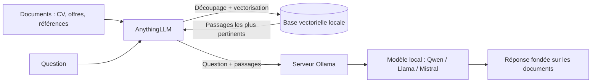

# Local RAG Benchmark — IA générative en local sur CPU

[](#1-matériel-et-environnement)
[](#1-matériel-et-environnement)
[](#2-architecture)
[](#2-architecture)
[](#6-feuille-de-route)
[](#licence)

Banc d'essai de modèles de langage compacts (3 à 7 milliards de paramètres) exécutés **100 % en local**, sur un mini-PC de bureau de 2017 **sans carte graphique dédiée**, et de leur usage en **RAG** (*Retrieval-Augmented Generation*) sur un corpus documentaire professionnel.

**Question de départ :** un poste bureautique ordinaire peut-il faire tourner une chaîne d'IA générative privée, sans cloud ni GPU, avec une vitesse et une fiabilité exploitables ?

---

## Table des matières

1. [Matériel et environnement](#1-matériel-et-environnement)
2. [Architecture](#2-architecture)
3. [Test 1 — Génération sans contexte](#3-test-1--génération-sans-contexte)
4. [Analyse du test 1](#4-analyse-du-test-1)
5. [Test 2 — RAG sur corpus documentaire (protocole)](#5-test-2--rag-sur-corpus-documentaire-protocole)
6. [Feuille de route](#6-feuille-de-route)
7. [Reproduction](#7-reproduction)
8. [Limites de l'étude](#8-limites-de-létude)

---

## 1. Matériel et environnement

| Composant | Spécification | Remarque |
| :--- | :--- | :--- |
| **Machine** | Lenovo ThinkCentre M910q (mini-PC, 2017) | Format « tiny », poste bureautique standard |
| **CPU** | Intel Core i5-6500T — 4 cœurs / 4 threads, 2,5 GHz (3,1 GHz en boost), 35 W | Instructions AVX2 disponibles |
| **GPU** | Aucun GPU dédié (Intel HD Graphics 530 intégré, non utilisé pour l'inférence) | Inférence entièrement sur CPU |
| **Mémoire** | 16 Go | Swap de 2 Go |
| **Stockage** | SSD NVMe 256 Go | Modèles et index locaux |
| **Système** | Linux Mint 22.3 (base Ubuntu 24.04), noyau 6.8, Xfce | — |

### Modèles installés (`ollama list`)

| Modèle | Taille sur disque | Paramètres |
| :--- | :---: | :---: |
| `qwen2.5:3b` | 1,9 Go | 3 milliards |
| `llama3.2:latest` | 2,0 Go | 3 milliards |
| `mistral:latest` | 4,4 Go | 7 milliards |

Un quatrième modèle, **Gemma 3 4B**, est également utilisé directement dans AnythingLLM.

---

## 2. Architecture



Le principe du RAG : **chercher d'abord, générer ensuite**. Les passages pertinents sont extraits des documents, puis fournis au modèle avec la question. Le modèle répond à partir de ces sources plutôt que de sa seule mémoire.

- **Moteur d'inférence :** [Ollama](https://ollama.com/), serveur local sur `http://127.0.0.1:11434`.
- **Orchestration RAG et interface :** [AnythingLLM Desktop](https://anythingllm.com/) 1.11.0, fournisseur LLM configuré sur Ollama, maintien en mémoire (*keep alive*) de 5 minutes, fenêtre de contexte détectée automatiquement.
- **Embeddings et découpage :** paramètres documentés lors du test 2.

---

## 3. Test 1 — Génération sans contexte

**Objectif :** mesurer la vitesse brute de chaque modèle sur ce CPU, et observer la qualité d'une réponse technique produite **sans aucun document de référence**.

**Méthode :** même question posée à chaque modèle via `ollama run <modèle> --verbose`, qui affiche les métriques d'exécution.

> *« Explique en cinq points ce qu'est le RAG (Retrieval-Augmented Generation), puis donne ses deux principales limites avec un petit modèle de langage. »*

### Résultats mesurés

| Modèle | Tokens lus | Lecture de la question | Tokens générés | Vitesse de génération | Durée totale |
| :--- | :---: | :---: | :---: | :---: | :---: |
| **Qwen 2.5 3B** | 63 | 25,3 tokens/s | 513 | **10,8 tokens/s** | **51 s** |
| **Mistral 7B** ⚠️ | 43 | 10,6 tokens/s | 656 | 0,75 tokens/s | 14 min 35 s |
| **Llama 3.2 3B** ⚠️ | 60 | 8,9 tokens/s | 659 | 0,81 tokens/s | 13 min 47 s |

> ⚠️ **Mesures à refaire en conditions isolées.** Llama 3.2 et Qwen 2.5 ont une taille comparable (3 milliards de paramètres, environ 2 Go), et un écart de vitesse d'un facteur 13 ne s'explique pas par le modèle. Les temps de chargement quasi nuls indiquent que plusieurs modèles étaient déjà en mémoire : ces deux mesures ont vraisemblablement été faussées par des exécutions concurrentes sur les quatre cœurs. Elles sont conservées ici telles qu'observées, en attendant une nouvelle série.

---

## 4. Analyse du test 1

### Vitesse

Qwen 2.5 3B génère environ **11 tokens par seconde** sur un CPU de 2017 sans GPU, soit une réponse de 500 mots en moins d'une minute. C'est une vitesse compatible avec un usage interactif au quotidien.

### Qualité : les trois modèles se trompent sur le RAG

Sans document de référence, **aucun des trois modèles ne décrit correctement le RAG** :

| Modèle | Erreur principale observée |
| :--- | :--- |
| **Qwen 2.5 3B** | Présente le RAG comme une forme d'« apprentissage supervisé » et invente des termes (« rétrovision », « rétrievés »). |
| **Mistral 7B** | Inverse l'ordre des étapes : décrit un modèle qui génère d'abord une réponse, puis cherche des données pour l'améliorer. |
| **Llama 3.2 3B** | Même inversion ; affirme en outre que le RAG « ajuste les paramètres du modèle », ce qui est faux (le RAG ne modifie pas les poids). |

Le français est correct pour Mistral et Llama, plus approximatif pour Qwen. Mais sur le fond, les trois réponses sont assurées et fausses.

### Enseignement

C'est l'argument même du projet, observé sur cette machine : **un petit modèle local, interrogé sur sa seule mémoire, hallucine, y compris sur un sujet technique**. Le test 2 vérifie si le fait de lui fournir des documents fiables corrige ces erreurs.

---

## 5. Test 2 — RAG sur corpus documentaire (protocole)

### 2a. Même question, avec contexte

Charger dans AnythingLLM un document de référence fiable expliquant le RAG, reposer exactement la question du test 1, et comparer les réponses **sans contexte** et **avec contexte**.

### 2b. Corpus professionnel

- **Corpus :** un CV (PDF) et cinq à dix offres d'emploi réelles du domaine (TXT ou PDF).
- **Espace de travail AnythingLLM dédié**, contexte réinitialisé entre chaque modèle.

| Réf. | Type de test | Question |
| :--- | :--- | :--- |
| **Q1** | Synthèse ciblée | « Résume en quatre points les exigences techniques de l'offre 1. » |
| **Q2** | Analyse croisée | « À partir de mon CV et des offres fournies, lesquelles correspondent le mieux à mes compétences principales ? » |
| **Q3** | Détection d'écarts | « Quelles compétences techniques demandées dans les offres n'apparaissent pas sur mon CV ? » |

### Grille d'évaluation

| Critère | Mesure |
| :--- | :--- |
| Vitesse | tokens/s et durée totale (`--verbose` ou métriques AnythingLLM) |
| Fidélité aux sources | exacte / partielle / erronée |
| Hallucinations | informations absentes des documents |
| Citations | le modèle s'appuie-t-il explicitement sur les passages fournis ? |

### Résultats

| Modèle | Test | Vitesse | Durée | Fidélité | Hallucinations | Observations |
| :--- | :---: | :---: | :---: | :---: | :---: | :--- |
| Qwen 2.5 3B | 2a / Q1 / Q2 / Q3 | *à mesurer* | | | | |
| Llama 3.2 3B | 2a / Q1 / Q2 / Q3 | *à mesurer* | | | | |
| Mistral 7B | 2a / Q1 / Q2 / Q3 | *à mesurer* | | | | |

---

## 6. Feuille de route

- [x] Installation d'Ollama et d'AnythingLLM sur CPU seul
- [x] Déploiement de trois modèles open source (Qwen 2.5 3B, Llama 3.2 3B, Mistral 7B)
- [x] Test 1 : vitesse et qualité sans contexte
- [ ] Nouvelle série de mesures en conditions isolées (un seul modèle chargé)
- [ ] Test 2a : même question avec document de référence
- [ ] Test 2b : RAG sur corpus CV et offres
- [ ] Documentation des paramètres d'embedding et de découpage
- [ ] Mesures de mémoire (`ollama ps`) et de température (`sensors`) en charge

---

## 7. Reproduction

### Prérequis

```bash
# Vérifier la présence des instructions AVX2
grep -o avx2 /proc/cpuinfo | head -1
```

### Modèles

```bash
ollama pull qwen2.5:3b
ollama pull llama3.2
ollama pull mistral
ollama list
```

### Mesure propre d'un modèle

```bash
# Vérifier qu'aucun autre modèle n'est chargé
ollama ps
ollama stop <modèle>        # pour chaque modèle encore chargé

# Lancer la mesure
ollama run qwen2.5:3b --verbose
```

Pendant la génération, dans un second terminal : `ollama ps` (mémoire occupée) et `sensors` (température du processeur).

### AnythingLLM

1. Installer AnythingLLM Desktop.
2. Paramètres → Fournisseurs d'IA → Préférence LLM : **Ollama**, URL `http://127.0.0.1:11434`.
3. Choisir le modèle, créer un espace de travail dédié, y déposer les documents.
4. Réinitialiser le contexte entre chaque changement de modèle.

---

## 8. Limites de l'étude

- Une seule exécution par modèle à ce stade : pas encore de moyenne ni d'écart-type.
- Deux des trois mesures du test 1 ont été prises dans des conditions non isolées (voir la note du §3).
- La qualité des réponses est évaluée manuellement.
- Les résultats sont propres à cette machine : un CPU plus récent ou un GPU changeraient fortement les vitesses.

---

## Licence

Projet partagé sous licence [MIT](LICENSE).
